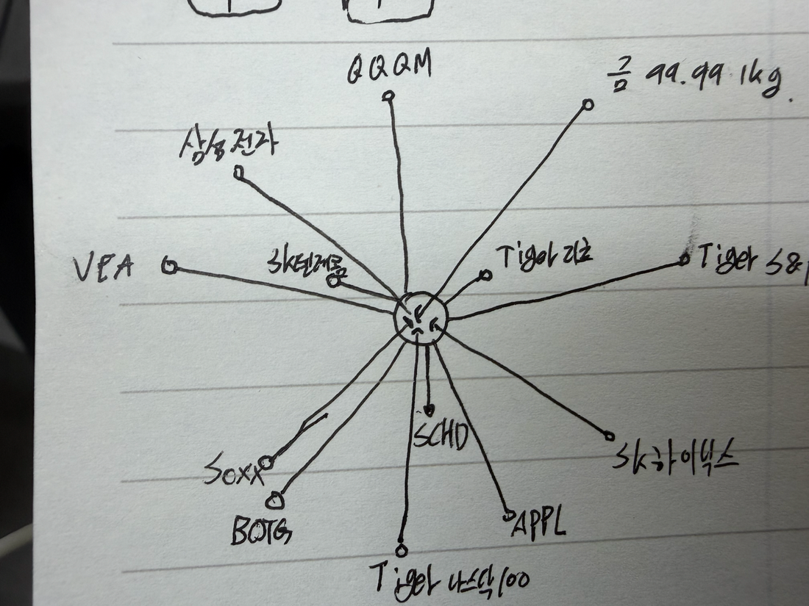
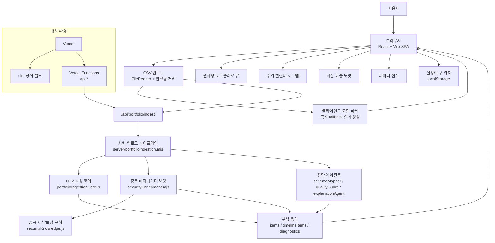

# AtomFolio +

투자 CSV를 업로드하면 종목 구성, 수익 흐름, 자산 비중, 위험/분산 상태를 자동으로 분석하고 원자형 포트폴리오 화면으로 보여주는 웹 대시보드입니다.

고정된 CSV 템플릿을 요구하지 않는 것이 핵심입니다. 증권사, 자산관리 앱, 직접 만든 엑셀 파일처럼 서로 다른 투자 데이터도 컬럼명과 값 패턴을 보고 해석한 뒤, 포트폴리오를 시각적으로 탐색할 수 있게 만듭니다.

## 바로가기

- 배포 주소: [https://atomfolio-plus.vercel.app](https://atomfolio-plus.vercel.app)
- GitHub 저장소: [https://github.com/amuldi/AtomFolio](https://github.com/amuldi/AtomFolio)
- 핵심 규칙 문서: [Skills.md](Skills.md)
- 기획서 PDF: [docs/proposal/AtomFolio_Plus_Proposal.pdf](docs/proposal/AtomFolio_Plus_Proposal.pdf)

## 목차

1. [프로젝트 요약](#프로젝트-요약)
2. [실행 화면](#실행-화면)
3. [제작 과정](#제작-과정)
4. [기능 상세 설명](#기능-상세-설명)
5. [데이터 처리 흐름](#데이터-처리-흐름)
6. [API](#api)
7. [실행 방법](#실행-방법)
8. [기술 스택](#기술-스택)
9. [프로젝트 구조](#프로젝트-구조)
10. [검증](#검증)

## 프로젝트 요약

| 항목 | 내용 |
| --- | --- |
| 프로젝트명 | AtomFolio + |
| 목적 | 투자 CSV를 자동 분석해 포트폴리오 구성과 위험 상태를 시각화 |
| 주요 사용자 | 투자 내역을 직접 정리하거나 여러 CSV를 비교하고 싶은 개인 사용자 |
| 프런트엔드 | React 18, Vite |
| 백엔드 | Node.js HTTP API, Vercel Functions |
| 배포 | Vercel |
| 외부 API 키 | 필요 없음 |
| 주요 입력 | CSV, TSV, TXT 투자 내역 |
| 주요 출력 | 원자형 포트폴리오, 수익 히트맵, 자산 비중 도넛, 레이더 점수 |

## 실행 화면

### 초기 아이디어 스케치

처음에는 포트폴리오를 표로 보여주는 대신, 중심 포트폴리오에서 여러 종목이 뻗어 나가는 구조를 손으로 그렸습니다. 현재 앱의 원자형 시각화는 이 스케치에서 출발했습니다.



### 업로드 전 첫 화면

첫 화면은 중앙 원자 코어, 설정 버튼, 업로드 버튼만 남겨 CSV 업로드 행동에 집중하도록 만들었습니다.


### CSV 업로드 후 대시보드

투자 데이터를 업로드하면 종목 노드가 중심 원자 주변에 펼쳐지고, 왼쪽 플로팅 도구에서 히트맵과 레이더 점수를 함께 확인할 수 있습니다. 


이때 도구는 사용자의 스타일에 따라 이동시킬 수 있습니다.


## 제작 과정

### 1. 문제 정의

투자 CSV는 파일마다 구조가 다릅니다. 어떤 파일은 `종목명`, 어떤 파일은 `상품명`, 어떤 파일은 `ticker`를 사용합니다. 수익도 `수익률`, `return`, `pnl`, `손익`처럼 서로 다르게 기록됩니다.

AtomFolio +는 사용자가 CSV를 앱 형식에 맞춰 고치는 대신, 앱이 CSV 구조를 이해하도록 설계했습니다.

### 2. 손그림 기반 UI 설계

포트폴리오가 여러 종목으로 이루어진다는 점을 원자 구조로 표현했습니다. 중심 원자는 전체 포트폴리오이고, 주변 원자는 각 보유 종목입니다. 이 구조는 종목 간 거리, 방향, 그룹 강조, hover 상세 정보로 확장됩니다.

### 3. CSV 파서 구현

브라우저에서 파일 텍스트를 읽고, 서버가 구분자와 헤더를 추론합니다. UTF-8과 EUC-KR을 고려하고, 헤더가 불명확한 경우에도 값 패턴을 분석해 날짜, 종목명, 수익률 후보를 찾습니다.

### 4. 종목 메타데이터 보강

CSV에는 종목명만 있는 경우가 많습니다. 앱은 종목명과 종목코드를 바탕으로 지역, 분야, 투자 스타일, 위험 등급, 자산군을 보강합니다. 이 정보는 원자형 시각화, 그룹 하이라이트, 레이더 점수, 자산 비중 계산에 사용됩니다.

### 5. 분석 도구 확장

원자형 포트폴리오만으로는 수익 흐름이나 분산 상태를 모두 설명하기 어렵습니다. 그래서 수익 캘린더, 자산 비중 도넛, 레이더 점수, 그룹 필터를 플로팅 도구로 추가했습니다.

### 6. 배포 구조 정리

로컬 개발에서는 Node.js 서버가 API를 처리하고, 배포 환경에서는 Vercel Functions가 같은 역할을 합니다. `vercel.json`은 Vite 빌드 산출물과 SPA 라우팅을 설정합니다.

## 기능 상세 설명

### 1. CSV 업로드

사용자는 업로드 버튼 또는 드래그 앤 드롭으로 투자 내역 파일을 넣을 수 있습니다.

**지원 파일**

- `.csv`
- `.tsv`
- `.txt`
- 쉼표, 탭, 세미콜론, 파이프 구분 텍스트

**구현 포인트**

- 여러 파일을 한 번에 업로드할 수 있습니다.
- 업로드된 파일은 포트폴리오 칩으로 표시됩니다.
- 각 포트폴리오는 개별적으로 선택하고 삭제할 수 있습니다.
- 파일 내용은 먼저 브라우저에서 읽고, 서버 API로 전달해 정밀 분석합니다.

**사용자 입장에서 좋은 점**

서로 다른 증권사 CSV를 하나의 화면에서 비교할 수 있고, CSV 구조를 앱에 맞게 고칠 필요가 줄어듭니다.

### 2. 문자 인코딩 처리

한국어 투자 CSV는 UTF-8이 아닌 EUC-KR로 저장되는 경우가 있습니다.

**구현 포인트**

- 브라우저에서 UTF-8과 EUC-KR 디코딩을 모두 시도합니다.
- 깨짐 문자가 적은 쪽을 선택합니다.
- 한글 종목명과 컬럼명이 깨지지 않도록 처리합니다.

**사용자 입장에서 좋은 점**

국내 증권사에서 내려받은 CSV도 별도 변환 없이 바로 올릴 가능성이 높아집니다.

### 3. CSV 구조 자동 추론

AtomFolio +는 고정된 컬럼명을 요구하지 않습니다.

**인식 가능한 컬럼 예시**

| 분류 | 컬럼 예시 |
| --- | --- |
| 종목 | `종목명`, `자산명`, `상품명`, `ticker`, `symbol`, `securityName` |
| 날짜 | `날짜`, `일자`, `거래일`, `매수일`, `date`, `tradeDate`, `buyDate` |
| 수익 | `수익률`, `일일수익률(%)`, `누적수익률(%)`, `손익`, `return`, `pnl` |
| 비중/금액 | `비중`, `자산비중(%)`, `평가금액`, `매수가`, `보유수량` |
| 계좌 | `계좌ID`, `계좌번호`, `계좌유형`, `accountId`, `accountType` |
| 분류 | `투자지역`, `분야`, `투자스타일`, `위험등급`, `자산구분` |

**구현 포인트**

- 헤더 이름과 실제 값 패턴을 함께 평가합니다.
- 날짜처럼 생긴 값, 수익률처럼 생긴 값, 종목명처럼 생긴 값을 구분합니다.
- 가장 가능성이 높은 컬럼을 표준 필드로 매핑합니다.
- 파싱 결과와 경고를 진단 데이터로 남깁니다.

### 4. 종목명 오인 방지

CSV에서 `미국`, `기술`, `선진국`, `고위험`, `40` 같은 값이 종목명처럼 잘못 잡히는 문제가 생길 수 있습니다.

**구현 포인트**

- 일반 분류어와 숫자성 값을 종목명 후보에서 낮게 평가합니다.
- `TIGER`, `KODEX`, `SPDR`, `iShares`, `Vanguard`, `NASDAQ`, `S&P`, `ETF` 같은 단서는 종목 또는 ETF 이름으로 인정합니다.
- 종목명, 종목코드, ticker 후보를 분리해 평가합니다.

**사용자 입장에서 좋은 점**

CSV 구조가 어긋나 있어도 포트폴리오 노드가 의미 없는 분류 값으로 채워지는 문제를 줄입니다.

### 5. 종목 메타데이터 보강

업로드된 CSV에 종목명만 있어도 앱이 분석에 필요한 분류 정보를 보강합니다.

**보강 정보**

- 종목코드
- 투자 지역
- 분야
- 투자 스타일
- 위험 등급
- 자산 구분
- 상장 시장
- 증권 유형

**구현 포인트**

- `src/lib/securityKnowledge.js`에 종목 지식과 보강 규칙을 둡니다.
- 서버에서는 `server/securityEnrichment.mjs`가 보강과 캐싱을 담당합니다.
- 보강 정보는 원본 날짜, 수익률, 손익 데이터를 덮어쓰지 않습니다.
- 캐시는 12시간 TTL로 유지합니다.

### 6. 원자형 포트폴리오 시각화

AtomFolio +의 중심 기능입니다.

**화면 구조**

- 중앙 원자: 전체 포트폴리오
- 주변 노드: 개별 종목
- 연결선: 포트폴리오와 종목의 관계
- 라벨: 종목명과 수익률

**구현 포인트**

- 종목 수에 따라 노드 위치를 자동 배치합니다.
- 수익률과 선택 상태에 따라 노드 강조가 달라집니다.
- 마우스 이동과 휠 입력으로 화면의 미세한 움직임을 만듭니다.
- SVG 기반이라 브라우저에서 가볍게 렌더링됩니다.

**사용자 입장에서 좋은 점**

표를 보지 않아도 포트폴리오가 어떤 종목들로 구성되어 있는지 직관적으로 볼 수 있습니다.

### 7. 종목 hover 상세 카드

종목 위에 마우스를 올리면 상세 정보 카드가 열립니다.

**표시 정보**

- 종목명
- 종목코드
- 계좌유형
- 매수일
- 매수가
- 보유수량
- 수익률
- 투자 지역
- 분야
- 투자 스타일
- 위험 등급
- 자산 구분

**구현 포인트**

- 카드 위치는 화면 밖으로 나가지 않도록 보정됩니다.
- 원본 CSV 필드와 보강 필드를 함께 보여줍니다.
- 수익률은 양수/음수 상태에 따라 시각적으로 구분됩니다.

### 8. 그룹 하이라이트

특정 기준으로 같은 그룹에 속한 종목을 강조할 수 있습니다.

**지원 기준**

- 투자 지역
- 분야
- 투자 스타일
- 위험 등급
- 자산 구분

**구현 포인트**

- 선택한 그룹 기준에 맞는 종목은 강조하고, 나머지는 흐리게 처리합니다.
- 그룹 도구는 플로팅 패널로 동작합니다.
- 포트폴리오 편중을 빠르게 확인할 수 있습니다.

**예시**

미국 자산 비중이 너무 크거나, 기술주가 대부분인 포트폴리오인지 한눈에 확인할 수 있습니다.

### 9. 수익 캘린더 히트맵

날짜별 수익률 또는 손익 흐름을 주 단위 캘린더로 보여줍니다.

**구현 포인트**

- 기본 범위는 최근 24주입니다.
- 같은 날짜에 여러 행이 있으면 수익률 또는 손익을 집계합니다.
- 값의 크기에 따라 칸의 밝기가 달라집니다.
- 날짜와 수익 데이터가 없으면 빈 상태 메시지를 표시합니다.

**사용자 입장에서 좋은 점**

어느 시점에 수익 또는 손실이 집중됐는지 빠르게 볼 수 있습니다.

### 10. 자산 비중 도넛 차트

포트폴리오가 어떤 종목과 자산군에 얼마나 나뉘어 있는지 보여줍니다.

**지원 보기**

- 자동 기준
- 종목별 기준
- 자산군 기준
- 계좌 기준

**비중 계산 우선순위**

1. CSV에 명시된 비중 컬럼
2. `매수가 * 보유수량`
3. 균등 비중

**구현 포인트**

- 도넛 중앙에는 가중 평균 총 수익률을 표시합니다.
- segment hover 시 차트와 범례가 함께 반응합니다.
- 원본 자산군을 우선할지, 앱의 자동 분류를 우선할지 설정할 수 있습니다.

### 11. 레이더 점수 차트

포트폴리오 상태를 6개 축으로 점수화합니다.

| 축 | 평가 기준 |
| --- | --- |
| 수익성 | 평균 수익률, 플러스 종목 비율, 하방 변동성 |
| 분산투자 | 종목 수, 자산군, 분야, 지역, 스타일 분산 |
| 위험관리 | 고위험 비중, 저위험 비중, 방어형 비중, 집중도 |
| 포트폴리오 구성 | 메타데이터 충실도와 자산/분야 균형 |
| 투자 타이밍 | 매수일 분산, 월별 분산, 투자 기간 |
| 수익 안정성 | 변동성, 손실 종목 비율, 방어형 비중 |

**가중치 프리셋**

- 균형 중심
- 수익 중심
- 장기수익 중심
- 안정 중심

**구현 포인트**

- 각 축은 0에서 100 사이의 점수로 계산됩니다.
- 중앙에는 전체 종합 점수를 표시합니다.
- 축에 hover하면 해당 축의 설명을 볼 수 있습니다.

### 12. 다중 포트폴리오 비교

여러 CSV를 업로드하면 각 파일이 포트폴리오 칩으로 표시됩니다.

**구현 포인트**

- 업로드된 포트폴리오 목록을 유지합니다.
- 현재 선택된 포트폴리오만 원자형 화면에 표시합니다.
- 포트폴리오별 파싱 결과, 종목 목록, 진단 결과를 분리해 관리합니다.

**사용자 입장에서 좋은 점**

계좌별, 기간별, 전략별 CSV를 나눠 올린 뒤 빠르게 전환하며 비교할 수 있습니다.

### 13. 설정 패널

오른쪽 상단 설정 버튼에서 앱 표시 방식을 바꿀 수 있습니다.

**설정 항목**

- 언어: 한국어, 영어
- 자산군 분류 방식: 자동 분류, 원본 우선
- 자산 비중 기준: 자동, 종목, 자산군, 계좌
- 레이더 점수 프리셋: 균형, 수익, 장기수익, 안정
- 플로팅 도구 위치 초기화

**구현 포인트**

- 사용자가 선택한 설정은 localStorage에 저장됩니다.
- 새로고침 후에도 설정과 도구 위치가 유지됩니다.

### 14. 플로팅 도구 시스템

그룹, 히트맵, 레이더, 자산 비중 도구는 화면 위에 떠 있는 패널로 동작합니다.

**구현 포인트**

- 도구는 펼침/접힘 상태를 가집니다.
- 드래그로 위치를 바꿀 수 있습니다.
- 화면 크기에 따라 패널이 왼쪽 또는 오른쪽으로 펼쳐집니다.
- 모바일에서는 크기와 여백이 별도로 계산됩니다.
- 도구 위치는 localStorage에 저장됩니다.

**사용자 입장에서 좋은 점**

분석 도구가 화면을 완전히 가리지 않고, 사용자가 원하는 위치에 배치할 수 있습니다.

### 15. 서버 측 진단 에이전트 흐름

업로드 결과를 단순히 파싱하는 것에서 끝내지 않고, 서버에서 진단 정보를 만듭니다.

| 모듈 | 역할 |
| --- | --- |
| `schemaMapper` | 어떤 컬럼을 어떤 표준 필드로 해석했는지 검토 |
| `qualityGuard` | 행 수, 날짜/수익률 인식률, 경고 상태 점검 |
| `explanationAgent` | 업로드 진단 결과를 사용자에게 설명할 문장으로 정리 |
| `orchestrator` | 스키마, 품질, 설명 결과를 하나로 결합 |

**구현 포인트**

- 진단 결과는 `agentReview`로 반환됩니다.
- 파싱이 완벽하지 않은 경우 경고를 남깁니다.
- 서버 분석에 실패하면 브라우저 로컬 파서 결과를 fallback으로 유지합니다.

### 16. Vercel 배포 지원

로컬 Node.js API와 Vercel 배포 환경을 모두 지원합니다.

**구현 포인트**

- `server/index.mjs`: 로컬 개발 및 preview 서버
- `api/health.js`: Vercel health function
- `api/portfolio/ingest.js`: Vercel CSV ingest function
- `api/securities/enrich.js`: Vercel 종목 보강 function
- `vercel.json`: Vite 빌드와 SPA fallback rewrite 설정

## 데이터 처리 흐름

```text
CSV 업로드
  -> 브라우저에서 파일 텍스트 읽기
  -> /api/portfolio/ingest POST 요청
  -> 구분자와 헤더 추론
  -> 컬럼별 의미 추론
  -> 종목, 날짜, 수익률, 계좌, 비중 필드 표준화
  -> 종목 메타데이터 보강
  -> timelineItems에 원본 시계열 유지
  -> 화면 표시용 종목 단위 데이터로 축약
  -> schemaMapper / qualityGuard / explanationAgent 진단
  -> 원자형 뷰, 히트맵, 도넛, 레이더 점수 렌더링
```

## 아키텍처



## API

### `GET /api/health`

서버 상태와 종목 보강 캐시 상태를 확인합니다.

**응답 예시**

```json
{
  "ok": true,
  "securityEnrichment": {
    "cacheSize": 0,
    "ttlMs": 43200000
  }
}
```

### `POST /api/portfolio/ingest`

CSV 텍스트를 파싱하고 포트폴리오 분석 결과를 반환합니다.

**요청 예시**

```json
{
  "fileName": "portfolio.csv",
  "text": "종목명,날짜,수익률\nTIGER 미국S&P500,2026-01-01,1.2%"
}
```

**주요 응답 필드**

| 필드 | 설명 |
| --- | --- |
| `items` | 화면 표시용 종목 단위 데이터 |
| `timelineItems` | 날짜별 원본 시계열을 유지한 데이터 |
| `parserDiagnostics` | 컬럼 추론과 파싱 진단 정보 |
| `agentReview` | 서버 측 진단 에이전트 결과 |
| `securityEnrichment` | 종목 메타데이터 보강 통계 |

### `POST /api/securities/enrich`

종목 리스트 또는 식별자 배열을 받아 메타데이터를 보강합니다.

**요청 예시**

```json
{
  "identifiers": ["360750", "AAPL", "TIGER 미국S&P500"],
  "force": false
}
```

## 실행 방법

### 1. 의존성 설치

```bash
npm install
```

### 2. 개발 서버 실행

```bash
npm run dev
```

개발 서버는 Vite 프런트엔드와 Node.js API 서버를 함께 실행합니다.

### 3. 프로덕션 빌드

```bash
npm run build
```

### 4. 빌드 결과 미리보기

```bash
npm run preview
```

## 샘플 데이터

검증용 CSV는 `samples/portfolio/`에 있습니다.

| 파일 | 검증 목적 |
| --- | --- |
| `portfolio_test0.csv` | 날짜 없는 포트폴리오 구성 데이터 |
| `portfolio_test1.csv` | 날짜별 수익률 시계열 데이터 |
| `portfolio_test2.csv` | 다종목 시계열 데이터 |
| `portfolio_test3.csv` | 컬럼 구조가 다른 데이터 |
| `portfolio_test4.csv` | 추가 시계열 케이스 |
| `portfolio_test5.csv` | 히트맵 빈 상태 확인용 날짜 결측 데이터 |
| `portfolio_test6.csv` ~ `portfolio_test12.csv` | 다양한 종목, 분류, 비중 조합 검증 데이터 |

## 기술 스택

| 영역 | 사용 기술 |
| --- | --- |
| Frontend | React 18, Vite |
| Visualization | SVG 기반 인터랙션, 커스텀 레이아웃/모션 유틸리티 |
| Backend | Node.js HTTP API, Vercel Functions |
| Data | CSV/TSV 파싱, 컬럼 추론, 종목 메타데이터 보강 |
| State | React state, localStorage |
| Deploy | Vercel |

## 프로젝트 구조

```text
api/
  _utils/http.js                  # Vercel 함수 공통 JSON/body 유틸리티
  health.js                       # Vercel health function
  portfolio/ingest.js             # Vercel portfolio ingest function
  securities/enrich.js            # Vercel security enrichment function
src/
  App.jsx                         # 메인 화면, 업로드, 상태, 도구 연결
  main.jsx                        # React 엔트리
  styles.css                      # 전체 스타일과 반응형 UI
  components/
    allocation/                   # 자산 비중 도넛 차트
    atom/                         # 원자형 포트폴리오 시각화
    cards/                        # hover, 히트맵, 점수 카드
    icons/                        # 손그림 스타일 SVG 아이콘
    panels/                       # 플로팅 그룹/히트맵/레이더 도구
  constants/                      # UI 크기, 씬 설정, 로컬 스토리지 키
  hooks/                          # 드래그 가능한 플로팅 도구 훅
  lib/                            # CSV 파싱, 히트맵, 자산 비중, 점수 계산
  utils/                          # 포맷, 수학, 레이아웃, 저장소 유틸리티
server/
  index.mjs                       # 로컬 API 서버와 정적 파일 서빙
  dev.mjs                         # 프런트/백엔드 동시 개발 실행
  portfolioIngestion.mjs          # 서버 측 업로드 파이프라인
  securityEnrichment.mjs          # 서버 측 종목 보강
  agents/                         # 스키마/품질/설명 진단 모듈
samples/portfolio/                # 검증용 투자 CSV
docs/assets/                      # README 이미지와 실행 화면
docs/proposal/                    # 기획서 원문/HTML/PDF
submission/                       # 제출용 PDF와 개발 산출물 ZIP
Skills.md                         # 분석/구현 규칙 문서
vercel.json                       # Vercel 빌드/라우팅 설정
```

## 검증

README 갱신 전후로 다음 항목을 확인합니다.

```bash
npm run build
curl -s https://atomfolio-plus.vercel.app/api/health
curl -s -X POST https://atomfolio-plus.vercel.app/api/portfolio/ingest \
  -H 'Content-Type: application/json' \
  -d '{"fileName":"smoke.csv","text":"종목명,날짜,수익률\nTIGER 미국S&P500,2026-01-01,1.2%"}'
```

최근 확인 결과:

- Vite 프로덕션 빌드 성공
- Vercel 프로덕션 배포 성공
- 메인 페이지 `200 OK`
- `/api/health` 정상 응답
- `/api/portfolio/ingest` 샘플 CSV 처리 성공

## 주의 사항

이 프로젝트는 투자 데이터를 시각화하고 분석 기준을 설명하는 대시보드입니다. 표시되는 점수와 분류는 투자 판단을 돕기 위한 참고 정보이며, 금융 투자 자문이나 매매 권유가 아닙니다.
